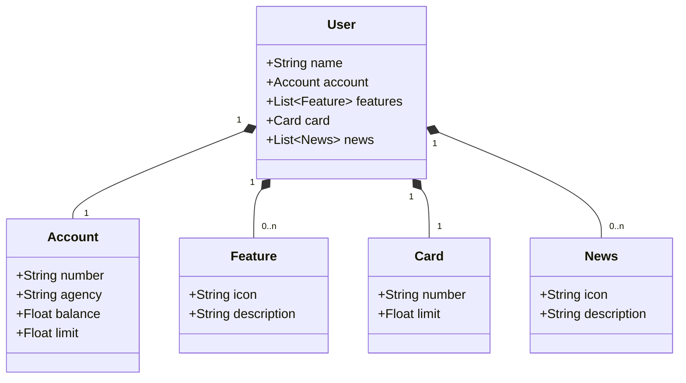

# Desafio de projeto: Publicando Sua API REST na Nuvem Usando Spring Boot 3, Java 17 e Railway

> Diagrama de classes do projeto prático da sub-trilha "Desenvolvimento de APIs com Spring Framework"

## Tecnologias utilizadas

- Java 17
- Spring Boot 3.1.2
- Spring Web
- Spring JPA
- Banco de dados H2 || PostgreSQL

## Licença

Este projeto está sob licença. Consulte [LICENSE](LICENSE) para obter mais informações.
