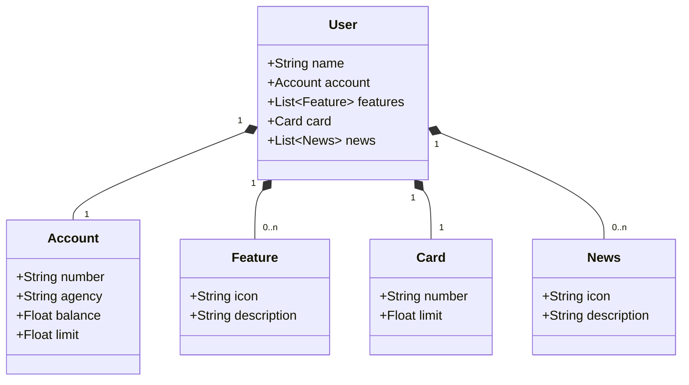

# Desafio de projeto: Publicando Sua API REST na Nuvem Usando Spring Boot 3, Java 17 e Railway

> Diagrama de classes do projeto prático da sub-trilha "Desenvolvimento de APIs com Spring Framework"

## Tecnologias utilizadas

- Java 17
- Spring Boot 3.1.2
- Spring Web
- Spring JPA
- Banco de dados H2 || PostgreSQL

## Observações importantes

- O projeto utiliza o padrão de arquivos `.yaml` ao inves de `application.properties`
  - Portanto, é preciso configurar um `profile` com a variável de ambiente `SPRING_PROFILES_ACTIVE` com valor `dev` para execução local ou `prod` para ambiente em produção.
- A publicação da API em produção foi possível mas manter a mesma neste estado não é possível, pois, a railway encerrou seu nível gratuito.

## Executando em ambiente local

Com o `profile` bem configurado, a porta exposta padrão é a `8080`.

Para visualização dos endpoints, uma interface pronta utilizando `Swagger` pode ser acessada no link: http://localhost:8080/swagger-ui/index.html.

Para acessar o banco de dados H2, entre no link http://localhost:8080/h2-console/ com as seguintes configurações

- JDBC URL: jdbc:h2:mem:dta2025
- User Name: dta2025

O `Password` é vazio!

## Executando em ambiente de produção

Realizei a publicação da API no site `railway`, entretanto, na época em que a video-aula do curso oferecido pela DIO foi gravada, a plataforma `railway` ainda era `free tier` e hoje não é mais! Logo, publiquei a API, validei e matei a mesma para evitar cobranças futuras.

## Licença

Este projeto está sob licença. Consulte [LICENSE](../LICENSE) para obter mais informações.
